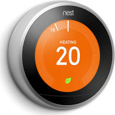

# Thermostat Nest

Ce plugin est un add-on pour le framework [Avatar](https://github.com/Spikharpax/Avatar-Serveur-3.0).

***
## ★ A savoir
Le thermostat Nest est automatiquement et nativement contrôlé par le plugin [Google-Assistant](https://github.com/Spikharpax/Avatar-Plugin-Google-Assistant) qui vous permet de contrôler tous vos appareils connectés avec l'assistant Google.

Ce plugin "spécial" Nest permet en plus:
- D'ajouter ou de modifier les règles de gestion du thermostat
- D'ajouter des phrases de validation des actions par A.V.A.T.A.R

Avec ce plugin, vous disposez aussi d'un exemple très simple pour vous permettre de gérer des règles associées d'un appareil connecté avec Google assistant.

***
## ★ Installation
* Téléchargez le projet depuis la bibliothèque de plug-ins A.V.A.T.A.R

***
## ★ Configuration et utilisation
* Aucune

***
## ★ License
Logiciel libre sous [licence MIT](https://github.com/Spikharpax/A.V.A.T.A.R/blob/master/LICENSE)

Copyright (c) 2020 A.V.A.T.A.R - Stéphane Bascher

  